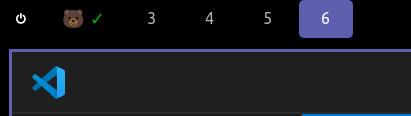
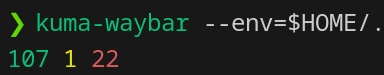

# Uptime Kuma for Waybar

This is a simple program to display the uptime of a system in a Waybar custom module.
You can run it in the cli to see the status overview of the system.
You can also output detailed status in json format.

It displays a green checkmark if all monitors are up, or a red, yellow and green numbers for the number of monitors that are down, pending and up respectively.

Zero dependencies, this script only uses the go standard library.

## Usage with Waybar




In your `waybar/config` file, add the following:
```json
"custom/kuma-waybar": {
    "exec": "kuma-waybar --format=waybar --env=$HOME/.config/waybar/kuma-waybar.env",
    "interval": 60,
    "on-click": "kuma-waybar open --env=$HOME/.config/waybar/kuma-waybar.env",
    "max-length": 40,
    "format": "🐻 {}"
},
```

Clicking on the module will open the Uptime Kuma dashboard in your default browser.
Interval is in seconds, so it will update automatically every 60 seconds.

Choose what order to place the custom element:
Here is an example of placing it to the left in between some other elements:
```json
"modules-left": [
    "custom/exit",
    "custom/kuma-waybar",
    "sway/workspaces"
],
```

See the [Waybar repo](https://github.com/Alexays/Waybar) for more information on Waybar config.

## Installation

```bash
git clone https://github.com/WebTender/kuma-waybar.git
cd kuma-waybar

# Builds and installs at /usr/local/bin/kuma-waybar
./install.sh

# Optionally remove the source code
cd ../
rm -rf kuma-waybar

# Now you can run the binary
kuma-waybar --help
```
Tip: For security you can review the [install.sh](install.sh) script before running it.

## Configuration

Provide a local `.env` in the working directory with the following content:
```env
UPTIME_KUMA_API_KEY=your-api-key
UPTIME_KUMA_BASE_URL=https://your-uptime-kuma-instance.com
```

You can also provide the `--env` argument to the script to point to the `.env` file.
E.g. `kuma-waybar --env=$HOME/.config/waybar/kuma-waybar.env`

**Where to get the API Key?**

You can get your API from `/settings/api-keys` of your Uptime Kuma instance or under Settings -> API Keys in Uptime Kuma.

Supports a few `--format` options:
- `--format=waybar` - Outputs the uptime summary in a format that Waybar can display.
- `--format=ansi` - (default) Outputs the uptime summary in a format that is easy to read in the cli.
- `--format=json` - Outputs the uptime details in a json format.
- `--format=jsonp` - Outputs the uptime details in a json format with indentation.

## CLI Usage
```bash
kuma-waybar
```



See also [Full JSON Output](#full-json-output) for more detailed monitor status.

## Full JSON Output
`kuma-waybar --format=json > kuma-status.json`

```bash
kuma-waybar --format=json > kuma-status.json
```
Tip: You can pipe into `jq` to parse the json output.


## License

MIT License

This script was written for our own purposes. Feel free to use without any restrictions. There is no warranty or guarantee of any kind.

PRs will be considered.

If you make use of this project, consider a BTC donation:
`BC1QZ3QQLZ5LK89DRKAU5N4HG47R9GFEMLYAKUCAMD`
